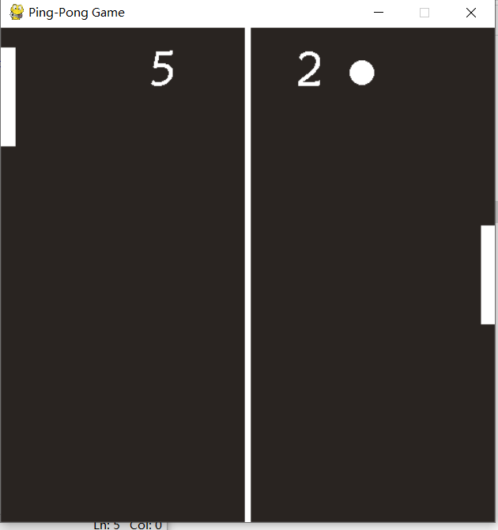

# Introduction
The Ping-Pong Game using the spirites and utils

# Environment
```
OS: Windows10
Python: Python3.9
```

# Usage
```
Step1:
pip install pygame
Step2:
run "python Ping-PongGame.main.py"
```

# Game Display

